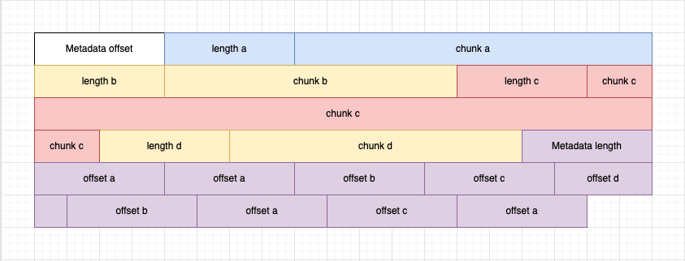

Deduper
==========

This module provides a variable size chunking base on CDC algorithm. <br/>
This project was created as a final project for Tel Aviv University's course "Adv. Storage Systems" (Semester 2022A).


Documentation 
=======
Compiling the project is the same as the standard for Golang.
```
go get 
go build 
```
Using the Deduper is very simple:

- Dedupe
``` 
 ./Deduper -dedup ./input-file-name ./output-file-name 
```
- UnDedupe
``` 
 ./Deduper -undedup ./input-file-name ./output-file-name 
```
- Compare
``` 
 ./Deduper -compare ./input-file-name ./output-file-name 
```

Internal Implementation
=============
<h3>The compressed file data structure<h4/>
  

<h3>The chunking algorithm </h3> 

<h3>Intenral Data Structures</h3>


